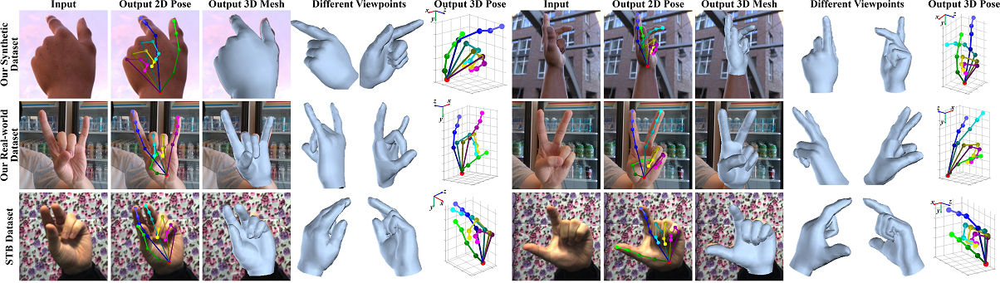

 3D_Hand_Pose_Estimation | CNTT K2 | Tan Trao University



### Introduction


### Installation
1. Install:
	pytorch >= v0.4.0
	numpy >= 1.13
	matplotlib 
	opencv-python >= 3.2
	opendr >= 0.76
	scipy >= 0.19.1
	yacs >= 0.1.6

3. Clone this repo
4. Install dependencies:
    ```
    pip install -r requirements.txt 
    ```


